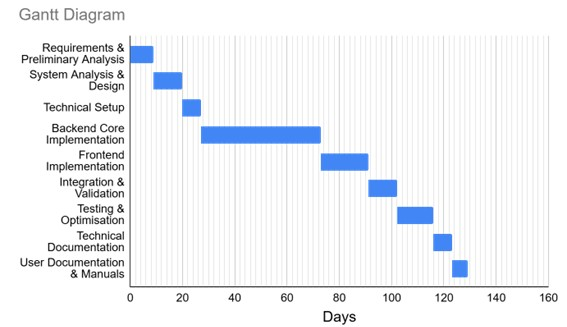
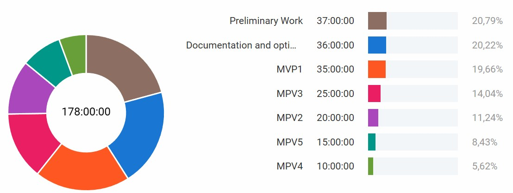

[](https://conventionalcommits.org) 

# Evidence-Based AI Research Assistant (EBARA)


[Powerpoint explanation](https://docs.google.com/presentation/d/1DjgQbwFGI4-6zMwd0eVSLmJgir2hqG8rPKnK-8G0qDY/edit?usp=sharing)

## Introduction

The Evidence-Based AI Research Assistant (EBARA) is a tool designed to assist researchers and healthcare professionals in retrieving and analyzing scientific articles from PubMed. It leverages advanced language models to generate optimized search queries and provide evidence-based responses to user queries about diseases, treatments, and pharmaceuticals.

Personal Motivation: The EBARA project stems from direct experience in the field of biomedical research, where the lack of agile tools for accessing scientific literature greatly slows down progress in clinical research and informed decision making. The possibility of developing a solution to speed up the consultation of evidence-based sources, especially in fields where time to access knowledge can make a critical difference, represents not only a technological challenge, but also a personal motivation linked to a commitment to improving the biomedical environment.

## User Stories

- **Story 1**: Transforming questions to PubMed queries.
As a researcher, I want to enter a natural language question to get relevant results from PubMed without the need to build complex queries.

   **Acceptance criteria**:
The system correctly interprets natural language queries.
An advanced PubMed query is generated.
The system returns relevant results in at least 80% of the tested cases.

- **Story 2**: Extracting relevant abstracts. 
As a user, I want the system to automatically retrieve the most relevant abstracts to speed up my search for scientific information.

   **Acceptance criteria**:
The system successfully connects to the PubMed API.
Minimum 3 abstracts are extracted per query.
Abstracts are stored temporarily for further processing.

- **Story 3**: Generation of contextualised responses.
As a user, I want to receive an AI-generated response based on the retrieved scientific information to save time in the literature review.

   **Acceptance criteria**:
A summary response of maximum 500 words is generated.
The response includes citations of the retrieved abstracts.
The generation is automatic with no manual intervention.

- **Story 4**: Query history and auditing.
As a user, I want to access my previous queries and answers so that I can review or audit my searches.

   **Acceptance criteria**:
All queries and answers are stored in SQLite.
You can access the history sorted by date.
It is possible to view the context associated with each answer.

- **Story 5**: Accessible and responsive interface.
As a user, I want the application to be easy to use on any device so that I can use EBARA from mobile, tablet or PC.
   
   **Acceptance criteria**:

   ●	The interface adapts correctly to different resolutions.

   ● Compatibility is tested in major browsers (Chrome, Firefox, Edge).

   ●	Complies with WCAG 2.1 level AA accessibility guidelines.

## 🔍 Objectives:

   - Implement a system capable of transforming natural queries into advanced PubMed queries.✅
   - Automatically extract relevant abstracts from the PubMed database.✅
   - Build an efficient FAISS-based index for rapid searches of the most relevant abstracts.✅
   - Generate contextual responses using a Large Language Model (LLM).✅
   - Store queries, responses, and context information in a SQLite database for future reference and auditing.✅

## 🧱 Technical Architecture:


## 🧰 Technologies Used

The EBARA project is built using a modern, open-source stack prioritizing performance, privacy, and reproducibility.

### 🧠 Main Language
- **Python**: Primary programming language for all components.

### ⚙️ Backend
- **FastAPI**: High-performance web framework for building RESTful APIs.
- **Pydantic**: Data validation and parsing using Python type annotations.
- **SQLite**: Lightweight, embedded relational database.
- **PyMed**: Python client for querying the PubMed API.

### 🔍 Natural Language Processing & AI
- **Hugging Face Transformers**: Used for generating embeddings from scientific abstracts.
- **FAISS** (Facebook AI Similarity Search): For vector indexing and semantic search.
- **Ollama**: Local LLMs for private, offline text generation.
- **OpenAI API** *(optional)*: Cloud-based alternative for LLM-powered responses.

### 💻 Frontend
- **Streamlit**: Python-based framework for building interactive web applications.

### 🧱 Architecture & Design Patterns
- **Clean Architecture**: Layered architecture for separation of concerns.
- **Factory Pattern**: For dynamic LLM connector instantiation.
- **SOLID Principles**:
  - Single Responsibility
  - Open/Closed
  - Liskov Substitution
  - Interface Segregation
  - Dependency Inversion

### 🐳 Deployment & DevOps
- **Docker**: Containerization of backend and frontend.
- **Docker Compose**: Service orchestration for local development.
- **GitHub Actions**: CI/CD for automated deployment and image updates.
- **Dev Containers**: Reproducible development environments.

### 📋 Project & Documentation Tools
- **Visual Studio Code**: IDEs for development.
- **Markdown** + **Diagrams**: Technical documentation.
- **Clockify**: Task and time

## Components Diagram:


## Features

- **Advanced Query Generation:** Converts user questions into optimized PubMed search queries.
- **Article Retrieval:** Fetches relevant articles from PubMed using the generated queries.
- **Embedding Processing:** Processes article abstracts to find the most relevant documents.
- **Response Generation:** Provides evidence-based answers to user queries.
- **Database Storage:** Saves queries, responses, and context for future reference.

## Deployment workflow:


## Development process:

The traceability of the development was managed with an iterative and incremental process with **comenvitonal commit** to identify the contribution made.

Estimation ~ 10 hour/week (180 hours in total).



- MVP 1 (Backend Endpoint & Modules development) → 35 h
- MVP 2 (Embedding & FAISS Integration) → additional 20 
- MVP 3 (Streamlit Frontend) → 25 h
- MVP 4 (Persistence & Auditing) → 10 h
- MVP 5 (Containerised Deployment & Final QA) → 15 h

### Final project dedication: clockify


## Pre-requisites and pre-configuration:

Use a PC with minimun of 16GBs of RAM and i5 processor. The use of GPU improves the fluidity and UX of the application.

The application is pre-configured to work with the [**Ollama**](https://ollama.com/download) connector so it is recommended to download and install the application locally.

After installation, the server must be set up to serve an LLM like llama3.2 for example.

   ```bash
   ollama run llama3.2
   ```

## Installation

To install the Evidence-Based AI Research Assistant (EBARA), follow these steps:

1. **Clone the repository:**

   ```bash
   git clone https://github.com/yourusername/ebara.git
   cd ebara
   ```
   
   **(OPTIONAL)** *Recomended for non technical users*:

   After cloning the github repository install [docker desktop](https://www.docker.com/products/docker-desktop/) to get the application running using docker-compose
   
   Run the next command on the terminal:
   
   ```bash
      docker-compose up
   ```
   This can take some minutes to setup, then go to `http://localhost:8501` to use de app.

3. **Create a virtual environment:**

   Establish a virtual environment for dependencies installation
   ```bash
   python -m venv env
   
   env\Scrypts\activate
   ```

2. **Install the required dependencies:**

   Ensure you have Python installed, then run:

   ```bash
   pip install -r requirements.txt
   ```

## Usage

### Command Line Interface

To use the CLI version of the assistant, run:
```bash
python src/cli.py
```

You will be prompted to enter your question about diseases, treatments, or pharmaceuticals. Type your question and press Enter. To exit, type `exit`.

### Web Interface

The assistant also provides a web interface using Streamlit. To start the web server, run:

```bash
streamlit run src/streamlit_app.py
```
Open your web browser and navigate to `http://localhost:8501` to access the interface.

### FastAPI Endpoint

To start the FastAPI endpoint, run:

```bash
uvicorn src.main:app --reload
```
Open your web browser and navigate to `http://localhost:8000` to access the endpoint.

## Contributing

We welcome contributions to the EBARA project. To contribute:

1. Fork the repository.
2. Create a new branch for your feature or bug fix.
3. Make your changes and commit them with clear messages.
4. Push your changes to your fork.
5. Submit a pull request to the main repository.

## License

This project is licensed under the GNU General Public License v3.0. See the [LICENSE](LICENSE) file for details.

### Code References

- CLI Implementation: `src/cli.py`
- Streamlit Web Interface: `src/streamlit_app.py`
- FastAPI Endpoint Implementation: `src/main.py`
- Model Manager and Query Generation: `src/models/model_manager.py`
- Embedding Processing: `src/models/embedding_processor.py`
- Database Management: `src/models/database_manager.py`

# References

1.	Hugging Face Transformers. (n.d.). Retrieved from https://huggingface.co/docs/transformers/
2.	FAISS Documentation. (n.d.). Retrieved from https://github.com/facebookresearch/faiss/wiki
3.	PubMed Official Web Page (n.d.). Retrieved from https://pubmed.ncbi.nlm.nih.gov/
4.	PyMed API Official Documentation. (n.d.). Retrieved from https://pypi.org/project/pymed/
5.	PostgreSQL Official Documentation. (n.d.). Retrieved from https://www.postgresql.org/docs/
6.	FastAPI Documentation. (n.d.). Retrieved from https://fastapi.tiangolo.com/
7.	Streamlit Documentation. (n.d.). Retrieved from https://docs.streamlit.io/
8.	SQLite Documentation. (n.d.). Retrieved from https://www.sqlite.org/docs.html
9.	Docker Documentation. (n.d.). Retrieved from https://docs.docker.com/
10.	OpenAI API Documentation. (n.d.). Retrieved from https://platform.openai.com/docs
11.	Ollama Documentation. (n.d.). Retrieved from https://ollama.com/docs
12.	FAISS Tutorial and Examples. (n.d.). Microsoft Azure. Retrieved from https://learn.microsoft.com/en-us/azure/architecture/example-scenario/ai/vector-search-faiss
13.	Martin, R. C. (2012, August 13). The Clean Architecture. Retrieved from https://8thlight.com/blog/uncle-bob/2012/08/13/the-clean-architecture.html
14.	Pydantic Documentation. (n.d.). Retrieved from https://docs.pydantic.dev/
15.	GitHub. (n.d.). Retrieved from https://github.com/
16.	Stack Overflow. (n.d.). Retrieved from https://stackoverflow.com/
17.	OpenAI. (n.d.). ChatGPT. Retrieved from https://chat.openai.com/

This documentation provides a comprehensive overview of the software, including how to install, use, and contribute to it. Adjust the contact information and repository URL as needed.